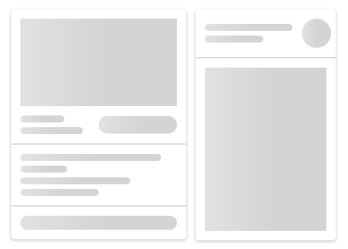

[](https://www.npmjs.com/package/skeleton-screen-css) [](https://travis-ci.com/github/nullilac/skeleton-screen-css)   [](https://www.jsdelivr.com/package/npm/skeleton-screen-css)

<p align="center">
    </img>
</p>

<h1 align="center">SKELETON SCREEN CSS</h1>

<p align="center">
    Zero dependencies, framework agnostic, a minimalistic set of skeleton screen elements consisting of pure css. Includes scss source, minified and non-minified compiled css files with browser vendor prefixes.
</p>

## What is it:

A skeleton screen is a visual placeholder that appears before the page content renders completely. It provides a low-fidelity preview of the fully rendered page in order to give the impression of a faster load time. A skeleton screen comprises lightly colored shapes, lines, and text that outline the structure of the page before the final content loads in its place.

**[See example](https://nullilac.github.io/skeleton-screen-css/)**

## How to install:

with npm

```bash
npm i skeleton-screen-css --save
```

or yarn

```bash
yarn add skeleton-screen-css
```

or you can download the archive with the project and manually transfer the necessary files to your project folder.

### Included files:

-   **index.scss** - source code with default variables;
-   **index.css** - non-minified compiled css with browsers vendor prefixes;
-   **index.min.css** - minified compiled css with browsers vendor prefixes (default with importing via modules);

## How to use:


Via browser:

```html
<link rel="stylesheet" href="index.min.css" />
```

Via webpack, rollup, parcel or any other bundler:

```javascript
import "skeleton-screen-css";

/* or */

require("skeleton-screen-css");
```

Via import from css/scss

```scss
/* May required path to file or alias if bundler used.
See the documentation for the bundler */

@import "skeleton-screen-css";
```

## How to override default variables

```scss
/* Override default variable */
$skeleton-element-color: #cecece;

/* Then import scss source file */
@import "skeleton-screen-css/dist/index.scss";
```

### Variables

```scss
$skeleton-element-color: rgba(0, 0, 0, 0.17) !default;

$skeleton-loading-animation-time: 1.3s !default;

$skeleton-margin-standart: 16px !default;

$skeleton-wrapper-padding: $skeleton-margin-standart !default;

$skeleton-margin-small: calc($skeleton-margin-standart / 2) !default;

$skeleton-card-box-shadow: 0 2px 4px 1px rgba(0, 0, 0, 0.17) !default;
$skeleton-card-background-color: #ffffff !default;
$skeleton-card-border-radius: 5px !default;

$skeleton-circle-size: 50px !default;

$skeleton-hr-height: 2px !default;

$skeleton-line-border-radius: 15px !default;
$skeleton-line-height: 12px !default;

$skeleton-headline-height: calc($skeleton-line-height * 2) !default;

$skeleton-square-height: 150px !default;
```

## Basic elements

```html
<!-- Elements classes -->
<div class="ssc-circle"></div>

<div class="ssc-head-line"></div>

<div class="ssc-line"></div>

<div class="ssc-square"></div>

<div class="ssc-hr"></div>

<!-- Card class -->
<div class="ssc-card"></div>

<!-- Wrapper class for padding -->
<div class="ssc-wrapper">Card with content</div>

<!-- Main parent class -->
<div class="ssc"></div>
```

## Helpers

```scss
/** Helpers classes */
.ssc {
    .mb {
        margin-bottom: $skeleton-margin-standart;
    }

    .mt {
        margin-top: $skeleton-margin-standart;
    }

    .mr {
        margin-right: $skeleton-margin-standart;
    }

    .ml {
        margin-left: $skeleton-margin-standart;
    }

    .mbs {
        margin-bottom: $skeleton-margin-small;
    }

    .mts {
        margin-top: $skeleton-margin-small;
    }

    .mrs {
        margin-right: $skeleton-margin-small;
    }

    .mls {
        margin-left: $skeleton-margin-small;
    }

    .w-10 {
        width: 10%;
    }

    .w-20 {
        width: 20%;
    }

    .w-30 {
        width: 30%;
    }

    .w-40 {
        width: 40%;
    }

    .w-50 {
        width: 50%;
    }

    .w-60 {
        width: 60%;
    }

    .w-70 {
        width: 70%;
    }

    .w-80 {
        width: 80%;
    }

    .w-90 {
        width: 90%;
    }

    .w-100 {
        width: 100%;
    }

    .flex {
        display: flex;
    }

    .inline-flex {
        display: inline-flex;
    }

    .flex-column {
        flex-direction: column;
    }

    .flex-column-reverse {
        flex-direction: column-reverse;
    }

    .flex-row {
        flex-direction: row;
    }

    .flex-row-reverse {
        flex-direction: row-reverse;
    }

    .align-center {
        align-items: center;
    }

    .align-start {
        align-items: flex-start;
    }

    .align-end {
        align-items: flex-end;
    }

    .align-stretch {
        align-items: stretch;
    }

    .justify-start {
        justify-content: start;
    }

    .justify-center {
        justify-content: center;
    }

    .justify-end {
        justify-content: end;
    }

    .justify-between {
        justify-content: space-between;
    }

    .justify-around {
        justify-content: space-around;
    }
}
```

## Example - card


```html
<div class="ssc ssc-card" style="max-width: 300px">
    <div class="ssc-wrapper">
        <div class="ssc-square mb"></div>
        <div class="flex align-center justify-between">
            <div class="w-40">
                <div class="ssc-line w-70 mbs"></div>
                <div class="ssc-line w-100 mbs"></div>
            </div>
            <div class="ssc-head-line w-50"></div>
        </div>
    </div>
    <div class="ssc-hr"></div>
    <div class="ssc-wrapper">
        <div class="ssc-line w-90 mbs"></div>
        <div class="ssc-line w-30 mbs"></div>
        <div class="ssc-line w-70 mbs"></div>
        <div class="ssc-line w-50 mbs"></div>
    </div>
    <div class="ssc-hr"></div>
    <div class="ssc-wrapper">
        <div class="ssc-head-line"></div>
    </div>
</div>
```

**[See more live examples](https://nullilac.github.io/skeleton-screen-css/)**
